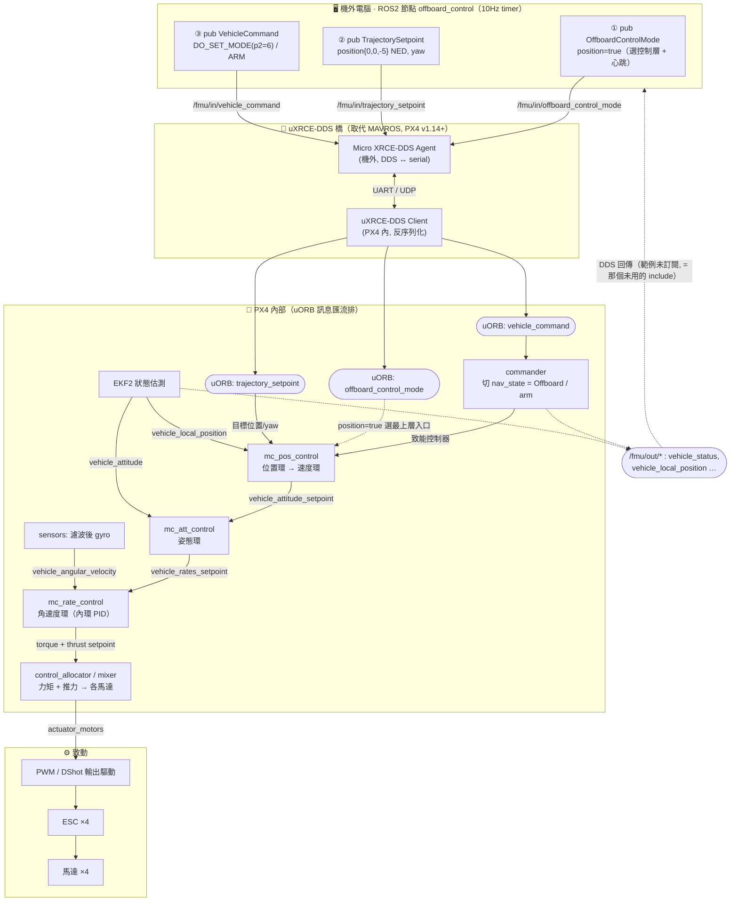

# 🗺️ M1 資料流圖 · 指令從 ROS2 節點 → DDS → PX4 → 馬達

> 模組：[reading-track.md](reading-track.md) Module 1（飛控與中介層架構與用法）
> 對應 code-reading：[m1-offboard-code-reading.md](m1-offboard-code-reading.md)（今天讀到的三個 `/fmu/in/*` topic 在此接上 uORB 與級聯控制器）
> 銜接：級聯控制細節（位置→速度→姿態→角速度）見 Module 2，本圖只標出「指令走哪條路」。
> 產出物類型：架構圖（M1「理解產出物」兩項之二，配合 code-reading 筆記收尾 M1）

---

## 0. 一句話總覽

今天讀的 `offboard_control` 節點，本質是**在最上層往一條單向管線塞命令**：

```
ROS2 節點 ──(3 個 /fmu/in/* topic)──► DDS 橋 ──► PX4 uORB ──► 級聯控制器 ──► mixer ──► 馬達
```

三個 topic 各自接到管線的不同入口：兩個 setpoint 流進**級聯控制器頂端**，一個 command 流進 **commander**（負責切模式 / arm）。EKF2 與感測器在每一環旁邊**回灌狀態**形成閉環。

---

## 1. Mermaid 圖（GitHub 可直接渲染）



---

## 2. ASCII 圖（純文字 / 終端機 fallback）

```
┌─ 機外電腦 · ROS2 node: offboard_control  (100ms / 10Hz timer) ──────────┐
│  每 cycle 成對送 ①②；counter==10 時送一次 ③ 切模式 + arm              │
│   ① OffboardControlMode ─► /fmu/in/offboard_control_mode               │
│   ② TrajectorySetpoint  ─► /fmu/in/trajectory_setpoint                 │
│   ③ VehicleCommand      ─► /fmu/in/vehicle_command                     │
└───────────────────────────────┬───────────────────────────────────────┘
                                 │  DDS over UART / UDP
                                 ▼
        [ uXRCE-DDS 橋 ]  Agent(機外) ⇄ Client(PX4內)     ← 取代 MAVROS
                                 │  反序列化 → republish 到 PX4 內部 uORB bus
                                 ▼
   [ uORB bus ] ── offboard_control_mode ──┐ (選控制層)
                ── trajectory_setpoint ─────┤ (目標數值)
                ── vehicle_command ─────────┘ (切模式/arm)
                       │                     │
          vehicle_command│                  │ mode + setpoint
                       ▼                     ▼
                 [ commander ] ──arm / nav_state=Offboard──► 致能下面整條
                       │
                       ▼   ↓↓↓  級聯控制器 cascade  ↓↓↓
   trajectory_setpoint ─► [① mc_pos_control  位置環→速度環 ]
                                 │ vehicle_attitude_setpoint
                                 ▼
                            [② mc_att_control  姿態環 ]
                                 │ vehicle_rates_setpoint
                                 ▼
                            [③ mc_rate_control 角速度環 (內環 PID) ]
                                 │ torque + thrust setpoint
                                 ▼
                            [ control_allocator / mixer ]
                                 │ actuator_motors
                                 ▼
                            [ PWM/DShot 驅動 ] ─► [ ESC ×4 ] ─► [ 馬達 ×4 ]

   閉環回饋（每一環旁邊回灌狀態）：
     sensors/IMU/GPS/baro ─► [ EKF2 ] ─┬─► 位置環  (vehicle_local_position)
                                        └─► 姿態環  (vehicle_attitude)
     sensors/gyro ───(濾波, 不經 EKF2)───► 角速度環 (vehicle_angular_velocity)
```

> ⚠️ **小但重要的準度點**：角速度環的回饋是**濾波後 gyro 直接餵進來**，不繞 EKF2——因為最內環要最低延遲。位置與姿態才走 EKF2。這也呼應 M2 「內環快、外環慢」的級聯設計。

---

## 3. 三個 `/fmu/in/*` topic ↔ 管線入口對照

| topic | uORB 訊息 | 消費者（PX4 內）| 在管線的入口 |
|---|---|---|---|
| `/fmu/in/offboard_control_mode` | `offboard_control_mode` | 級聯控制器（選層）+ commander（判定 Offboard 還活著）| 心跳 + 「進哪一層」的選擇器 |
| `/fmu/in/trajectory_setpoint` | `trajectory_setpoint` | `mc_pos_control` | 級聯**最上層**（因範例 position=true）|
| `/fmu/in/vehicle_command` | `vehicle_command` | `commander` | 旁路：切 nav_state / arm，不進控制環 |

---

## 4. `OffboardControlMode` 的 bool → 命令從哪一層進級聯

今天讀到的「五個 bool 是級聯的層級選擇器」，在這張圖上就是**選哪個方塊當入口**：

| bool = true | 命令進入級聯的哪一層 | 跳過的環 | setpoint 有意義的欄位 |
|---|---|---|---|
| `position` ←(本範例) | 最上層 `mc_pos_control` | 無（走完整條）| `position[3]`, `yaw` |
| `velocity` | 速度環 | 位置 | `velocity[3]`, `yaw` |
| `acceleration` | 加速度 → 推力 | 位置/速度 | `acceleration[3]` |
| `attitude` | `mc_att_control` | 位置/速度 | 改送 `vehicle_attitude_setpoint` |
| `body_rate` | `mc_rate_control`（最內）| 位置/速度/姿態 | 改送 `vehicle_rates_setpoint` |

> 記法：**bool 選的是「命令插進管線的哪個樓層」，樓層以下永遠照走。** 範例選最高樓層（位置），所以一路 position → velocity → attitude → rate → mixer 走到底。

---

## 5. 自我驗收（對應 reading-track Module 1 產出物）

- [ ] 能不看圖、口頭講出 `ROS2 → DDS 橋 → uORB → commander/控制器 → mixer → 馬達` 七段，並指出三個 `/fmu/in/*` 各接哪裡
- [ ] 能說 `vehicle_command` 為何走 commander（旁路）、setpoint 為何走控制器（主線）
- [ ] 能指出 EKF2 回灌哪兩環、gyro 為何**直連**角速度環
- [ ] 能用 `OffboardControlMode` 的 bool 解釋「命令從哪一層進級聯」
- [ ] ✅ M1 兩項理解產出物到齊：code-reading 筆記（[m1-offboard-code-reading.md](m1-offboard-code-reading.md)）+ 本資料流圖 → 可進 Module 2
```
