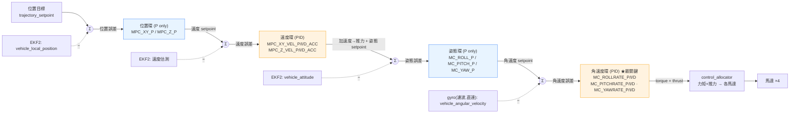

# 🎯 M2 級聯控制方塊圖 · 位置→速度→姿態→角速度 + 症狀↔參數對照表

> 模組：[reading-track.md](reading-track.md) Module 2（控制理論與 PID，純概念）
> 銜接：本圖是 [m1-dataflow-diagram.md](m1-dataflow-diagram.md) §1「級聯控制器」那一段的放大版——M1 看「指令走哪條路」，M2 看「每一環在算什麼、調哪個參數」。
> 讀什麼：PX4 *Controller Diagrams* + *MC PID Tuning Guide*（<https://docs.px4.io/>）、Brian Douglas 控制系列。
> 產出物類型：級聯方塊圖（Mermaid + ASCII）+「症狀 ↔ 參數」對照表（不需實際調，理解因果即可）。

---

## 0. 一句話總覽

PX4 多旋翼控制是**四層串接的閉環**,外層輸出當內層的目標(setpoint),內層更快、外層更慢:

```
位置(P) → 速度(PID) → 姿態(P) → 角速度(PID) → 控制分配 → 馬達
 慢 ────────────────────────────────────────────► 快
```

**關鍵直覺**:**外兩層(位置/姿態)只用 P,內層(速度/角速度)才用完整 PID**。最內的角速度環是「飛得穩不穩」的命脈,調參幾乎都從它開始。

---

## 1. Mermaid 方塊圖(GitHub 可直接渲染)



> 🔵 藍 = 只有 P 的外環(位置/姿態) 🟠 橘 = 完整 PID 的內環(速度/角速度)。
> 每個 `Σ` 是誤差節點:`誤差 = 目標 − 回饋`,控制器吃誤差、吐下一層的目標。

---

## 2. ASCII 方塊圖(純文字 fallback)

```
  trajectory_setpoint
        │
        ▼
      (Σ)◄──────────────── vehicle_local_position        [EKF2]
        │ 位置誤差
        ▼
   ┌───────────────────────────┐
   │ ① 位置環   P only          │   MPC_XY_P / MPC_Z_P
   └───────────────────────────┘
        │ 速度 setpoint
        ▼
      (Σ)◄──────────────── 速度估測                       [EKF2]
        │ 速度誤差
        ▼
   ┌───────────────────────────┐
   │ ② 速度環   P I D           │   MPC_XY_VEL_P/I/D_ACC
   └───────────────────────────┘   MPC_Z_VEL_P/I/D_ACC
        │ 加速度→推力 + 姿態 setpoint
        ▼
      (Σ)◄──────────────── vehicle_attitude               [EKF2]
        │ 姿態誤差
        ▼
   ┌───────────────────────────┐
   │ ③ 姿態環   P only          │   MC_ROLL_P / MC_PITCH_P / MC_YAW_P
   └───────────────────────────┘
        │ 角速度 setpoint
        ▼
      (Σ)◄──────────────── vehicle_angular_velocity   [gyro 濾波, 直連不繞 EKF2]
        │ 角速度誤差
        ▼
   ┌───────────────────────────┐
   │ ④ 角速度環 P I D  ★最關鍵  │   MC_ROLLRATE_P/I/D
   └───────────────────────────┘   MC_PITCHRATE_P/I/D · MC_YAWRATE_P/I/D
        │ torque + thrust setpoint
        ▼
   [ control_allocator / mixer ] ──► [ 馬達 ×4 ]

  由外到內：慢 ───────────────────────────────► 快
  調參順序：由內到外  ④ → ③ → ② → ①
```

---

## 3. `MC_ROLL_P` vs `MC_ROLLRATE_P`（reading-track 指定要分清）

兩個都叫「roll 的 P」,但**在不同樓層、控不同物理量**——這是 M2 最常被考的混淆點:

| | `MC_ROLL_P` | `MC_ROLLRATE_P` |
|---|---|---|
| 所屬環 | ③ 姿態環(外)| ④ 角速度環(內)|
| 控什麼 | roll **角度**誤差 | roll **角速度**誤差 |
| 輸入→輸出 | 角度誤差 → **角速度** setpoint | 角速度誤差 → **力矩** |
| 該環用 | **只有 P** | 完整 **PID**(還有 `MC_ROLLRATE_I/D`)|
| 物理意義 | 「歪了多少 → 該以多快轉回去」| 「該轉這麼快,但實際差多少 → 出多大力矩」|
| 調壞症狀 | 太大→姿態過衝/回彈;太小→翻轉遲鈍、軟趴趴 | 太大→高頻抖動/嗡鳴/馬達發燙;太小→鬆散、抗擾差 |

> 記法:**`*RATE_*` 一定是最內的角速度環(力矩級、PID 全到齊);沒有 `RATE` 的 `MC_ROLL_P` 是上一層的姿態環(只有 P)。** 先把內環 `MC_ROLLRATE_*` 調穩,外環 `MC_ROLL_P` 才有意義。

---

## 4. 症狀 ↔ 參數 對照表

> 用法:看到飛行**症狀**→ 先判斷是哪一環、哪個增益、偏大還偏小。先修內環(角速度),再往外。

### 4a. 角速度環 ④（內環,PID,最先調、最關鍵）

| 參數 | 太大的症狀 | 太小的症狀 |
|---|---|---|
| `MC_ROLLRATE_P` / `MC_PITCHRATE_P` | 高頻振動、機身抖/嗡嗡聲、馬達發燙、急停時抽動 | 反應遲鈍、軟、抗風/抗擾差、慢慢飄 |
| `MC_*RATE_I` | 低頻搖晃、急打杆後持續振盪、過衝後盪回來 | 穩態角度撐不住(逆風/重心偏移會慢慢歪)、長時間累積誤差 |
| `MC_*RATE_D` | 放大噪聲→高頻抖動、馬達熱、小擾動就抽動 | 急機動後過衝、回彈、阻尼不足 |
| `MC_*RATE_K`(整體增益縮放)| 等比放大 P/I/D → 同「P 太大」徵狀 | 等比縮小 → 整體變鈍 |

### 4b. 姿態環 ③（外,P only）

| 參數 | 太大 | 太小 |
|---|---|---|
| `MC_ROLL_P` / `MC_PITCH_P` | 改變姿態時過衝/回彈,可能激出內環振盪 | 姿態跟隨遲鈍、到不了指定角度、飄忽 |
| `MC_YAW_P` | 機頭轉向過衝/抖動 | 轉向慢吞吞、對不準航向 |

### 4c. 速度環 ②（內,PID,位置控制器內部）

| 參數 | 太大 | 太小 |
|---|---|---|
| `MPC_XY_VEL_P_ACC` / `MPC_Z_VEL_P_ACC` | 速度振盪、頓挫、移動時晃 | 速度跟隨慢、容易被風帶走 |
| `MPC_*_VEL_I_ACC` | 低頻速度振盪、位置過衝 | 穩態速度誤差、逆風推不回去 |
| `MPC_*_VEL_D_ACC` | 噪聲放大→抖 | 速度變化時過衝、阻尼不足 |

### 4d. 位置環 ①（最外,P only）

| 參數 | 太大 | 太小 |
|---|---|---|
| `MPC_XY_P` | 到點過衝、繞著 waypoint 振盪、抵達時回彈 | 到點慢、位置誤差大、定點鬆(easy drift)|
| `MPC_Z_P` | 高度過衝/上下彈 | 爬升/定高慢、高度誤差大 |

---

## 5. 調參順序與心法（PX4 官方建議）

1. **由內到外**:角速度環 ④ → 姿態環 ③ → 速度環 ② → 位置環 ①。內環不穩,外層怎麼調都白搭。
2. 內環(④)單環各軸:先升 `*RATE_P` 到剛要抖→退一點;再加 `*RATE_D` 壓過衝;最後加 `*RATE_I` 收穩態誤差。
3. **P 找速度、D 找阻尼、I 找穩態**——P 太猛交給 D 收,長期歪交給 I 補。
4. 多用 QGroundControl 即時圖 / [Flight Review](https://logs.px4.io) 看 ulog 的 rate tracking,別純靠肉眼。
5. 不確定先動哪個 → **永遠先懷疑內環角速度 P**(振動)或 D(噪聲)。

> 一句話:**外環決定「要去哪」,內環決定「穩不穩」;振動先看內環、遲鈍先看 P、撐不住先看 I。**

---

## 6. 自我驗收（對應 reading-track Module 2 + progress-tracker W2）

- [ ] 能默畫位置→速度→姿態→角速度四層方塊圖,標出每層的回饋來源與輸出 setpoint
- [ ] 能說清**哪兩層只有 P、哪兩層是完整 PID**,並解釋為何內環需要 D
- [ ] 能一句話分清 `MC_ROLL_P`(姿態環/角度/P)vs `MC_ROLLRATE_P`(角速度環/力矩/PID)
- [ ] 看到「高頻抖動」「遲鈍軟趴」「撐不住慢慢歪」能各自指到正確的環與增益
- [ ] 能說出**由內到外**的調參順序與「P 速度 / I 穩態 / D 阻尼」心法
- [ ] ✅ M2 理解產出物到齊(本圖 + 對照表)→ 可進 Module 3（AI 模型架構與用法）
```
