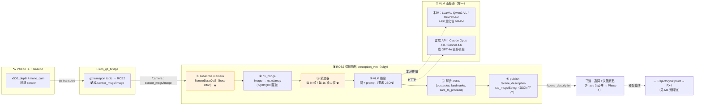

# 🗺️ M3 感知 pipeline 架構圖 · 相機影像 → VLM → 語義

> 模組：[reading-track.md](reading-track.md) Module 3（AI 模型架構與用法）／**動手路線** [03-phase3-ai-perception.md](03-phase3-ai-perception.md) Week 5 Day 6（交付物）+ Day 7（整理架構圖）
> 產出物類型：架構圖（Mermaid + ASCII）+ topic/訊息對照 + JSON schema —— Week 5 交付物「影像→VLM→語義 ROS2 節點」的收尾圖。
> 銜接：本圖是**感知前端**；動作後端（送 `TrajectorySetpoint` 回 PX4）見 [m1-dataflow-diagram.md](m1-dataflow-diagram.md)。兩者接起來＝Phase 4 的 Embodied 迴圈。

---

## 0. 一句話總覽

把模擬器的相機畫面，變成**程式可解析的語義 JSON**，這條路只有六段：

```
Gazebo 相機 ─► ros_gz_bridge ─► ROS2 節點(訂閱) ─► cv_bridge ─► 節流抽幀 ─► VLM ─► 語義 JSON ─► /scene_description
   sensor_msgs/Image           best-effort QoS    Image→np    每 1s 一幀   本地/API   結構化解析     給下游決策
```

**關鍵直覺**：這是 M1 資料流的**鏡像**——M1 是「指令**往下**灌進 PX4」，M3 是「感知**往上**抽成語義」。兩條合起來，無人機才有「看 → 想 → 動」的閉環（Phase 4）。中間三個最容易出事的點：**QoS 不匹配收不到、cv_bridge 編碼錯亂、每幀都呼叫 VLM 又慢又貴**。

---

## 1. Mermaid 圖（GitHub 可直接渲染）



> 🟠 橘 = 兩個最常翻車的環節：**①訂閱 QoS**（best-effort 才收得到相機）與**③節流**（別每幀打 VLM）。

---

## 2. ASCII 圖（純文字 / 終端機 fallback）

```
┌─ PX4 SITL + Gazebo ───────────────┐
│   x500 相機 sensor                 │
└───────────────┬───────────────────┘
                │ gz transport topic
                ▼
        [ ros_gz_bridge ]  gz → ROS2，轉成 sensor_msgs/Image
                │  /camera : sensor_msgs/Image
                ▼
┌─ ROS2 節點 perception_vlm (rclpy) ─────────────────────────────────┐
│  ① subscribe /camera   ◄── ★用 SensorDataQoS(best-effort)否則收不到 │
│        │ sensor_msgs/Image                                          │
│        ▼                                                            │
│  ② cv_bridge: imgmsg_to_cv2(msg, "bgr8")  ── Image → np.ndarray     │
│        │  ★ 編碼要和來源一致(bgr8/rgb8)，否則顏色翻                  │
│        ▼                                                            │
│  ③ 節流器: 每 N 幀 / 每 1s 才抽一幀  ── ★ 否則 30fps 全打 VLM=慢+貴  │
│        │ 抽到的單幀                                                  │
│        ▼                                                            │
│  ④ VLM 推論(擇一):                                                  │
│        ├─ 本地  : LLaVA / Qwen2-VL / MiniCPM-V (4-bit 量化)          │
│        └─ 雲端  : Claude Opus 4.8/Sonnet 4.6、GPT-4o 級 (HTTP)       │
│        │  prompt 強制輸出 JSON schema                               │
│        ▼                                                            │
│  ⑤ 解析 JSON → {obstacles:[], landmarks:[], safe_to_proceed:bool}   │
│        ▼                                                            │
│  ⑥ publish /scene_description (std_msgs/String = JSON 字串)         │
└───────────────┬────────────────────────────────────────────────────┘
                │ /scene_description
                ▼
        [ 下游 避障/決策節點 ]  例: safe_to_proceed=false → 停 / 繞行
                │  （Phase 3 延伸 → Phase 4）
                ▼
        [ → TrajectorySetpoint → PX4 ]   ← 接回 M1 的指令資料流
```

> ⚠️ **準度點**：相機影像幾乎都是 **best-effort** 發布；ROS2 預設訂閱是 **reliable** → **QoS 不匹配 = 一張都收不到**（這正是 M1 提過、本例「有訂閱」才會踩到的那個坑）。`rclpy` 用 `qos_profile_sensor_data` 解。

---

## 3. topic / 訊息對照表

| 段 | topic | 訊息型別 | 方向 | 關鍵點 |
|---|---|---|---|---|
| 影像源 | gz transport（模型 SDF 定）| Gazebo Image | Gazebo → bridge | 名稱依 airframe/SDF |
| 橋後 | `/camera`（自取名）| `sensor_msgs/msg/Image` | bridge → 節點 | 由 `ros_gz_bridge` 轉出 |
| 語義出 | `/scene_description` | `std_msgs/msg/String`（JSON）| 節點 → 下游 | 先用 String 裝 JSON 最快；要嚴謹再定 custom msg |
| （可選）深度 | `/depth_camera` | `sensor_msgs/msg/Image`(32FC1) | bridge → 節點 | x500_depth 才有，給避障距離 |

> 為何 `/scene_description` 先用 `std_msgs/String` 裝 JSON：**最快跑通**、人眼可 `ros2 topic echo` 直接讀。穩定後再升級成自訂 msg（欄位型別檢查更安全）。

---

## 4. VLM 兩條路怎麼選

| | 🖥️ 本地 VLM | ☁️ 雲端多模態 API |
|---|---|---|
| 代表 | LLaVA / LLaVA-Phi、Qwen2-VL、MiniCPM-V | **Claude Opus 4.8 / Sonnet 4.6**、GPT-4o 級 |
| 需求 | 要 GPU/VRAM（4-bit 量化可降）| **無需 GPU**，要網路 + API key |
| 延遲 | 視 GPU；可離線 | 受網路/排隊影響 |
| 成本 | 一次性硬體 | 按呼叫計費 → **務必節流** |
| 品質 | 輕量模型較弱 | 高（複雜場景語義更準）|
| 何時用 | 邊緣部署、要離線/低延遲 | 無 GPU、要最佳語義、快速雛形 |

> 建構 AI 應用預設選**最新最強 Claude（Opus 4.8）**；要低延遲/低成本改 Sonnet 4.6 或 Haiku 4.5。本地與 API 在本 pipeline **是可抽換的 ④**，介面（圖進、JSON 出）不變。

---

## 5. prompt 與 JSON schema（讓輸出可被程式吃）

VLM 自由文字難解析 → **用 prompt 強制結構化**，下游才接得住：

```text
System/Prompt:
你是無人機視覺感知模組。只輸出 JSON，不要多餘文字。
schema:
{
  "obstacles":  [ {"label": str, "direction": "left|center|right", "rough_distance": "near|mid|far"} ],
  "landmarks":  [ {"label": str, "direction": "left|center|right"} ],
  "safe_to_proceed": bool
}
```

```json
// 範例輸出（publish 到 /scene_description）
{
  "obstacles": [ {"label": "tree", "direction": "center", "rough_distance": "near"} ],
  "landmarks": [ {"label": "red building", "direction": "left"} ],
  "safe_to_proceed": false
}
```

> 收斂規則：**先固定 schema，再寫節點**。`safe_to_proceed` 這種布林讓下游決策（停/繞）一行就能判。解析務必 `try/except`（VLM 偶爾吐壞 JSON → 丟棄該幀、不要讓節點掛掉）。

---

## 6. 節流策略（③ 的三種寫法）

| 寫法 | 做法 | 適用 |
|---|---|---|
| 計數法 | 每收到 N 幀才處理 1 幀 | 最簡單，幀率穩時夠用 |
| 計時法 | 記上次呼叫時間，距今 ≥1s 才呼叫 | **推薦**：直接限「每秒幾次 API」 |
| 旗標法 | VLM 還在跑就丟新幀（單例在途）| 避免請求塞車、堆積延遲 |

> 三者可疊加：計時法控頻率 + 旗標法防重入。**永遠別在 subscriber callback 裡同步 block 等 VLM**（會卡住 spin、漏掉後續影像）——用旗標/執行緒或 async。

---

## 7. 自我驗收（對應 Phase 3 Week 5 checkpoint + reading-track Module 3）

- [ ] 能口述六段：相機 → ros_gz_bridge → 訂閱 → cv_bridge → 節流 → VLM → 解析 → publish
- [ ] 能說為何相機訂閱要用 **best-effort（SensorDataQoS）**，否則收不到
- [ ] 能說 `cv_bridge` 的 bgr8/rgb8 不一致會怎樣（顏色翻）
- [ ] 能講出**為何要節流**、並寫出計時/計數/旗標三種其一
- [ ] 能設計強制 **JSON schema** 的 prompt，並對壞 JSON 做防呆
- [ ] 能說明本地 VLM 與雲端 API 在本 pipeline 是**可抽換的同一段 ④**
- [ ] 能指出本圖（感知前端）如何接回 [M1 資料流](m1-dataflow-diagram.md)（動作後端）成 Phase 4 閉環
- [ ] ✅ Week 5 交付物到齊：影像→VLM→語義節點 + 本架構圖

➡️ 相關：[M3 五點筆記+對照表](m3-ai-models-comparison.md)｜[OpenVLA cheat-sheet](m3-openvla-inference-cheatsheet.md)｜[M1 資料流圖](m1-dataflow-diagram.md)｜下一階段 [Phase 4 整合](04-phase4-integration-papers.md)
